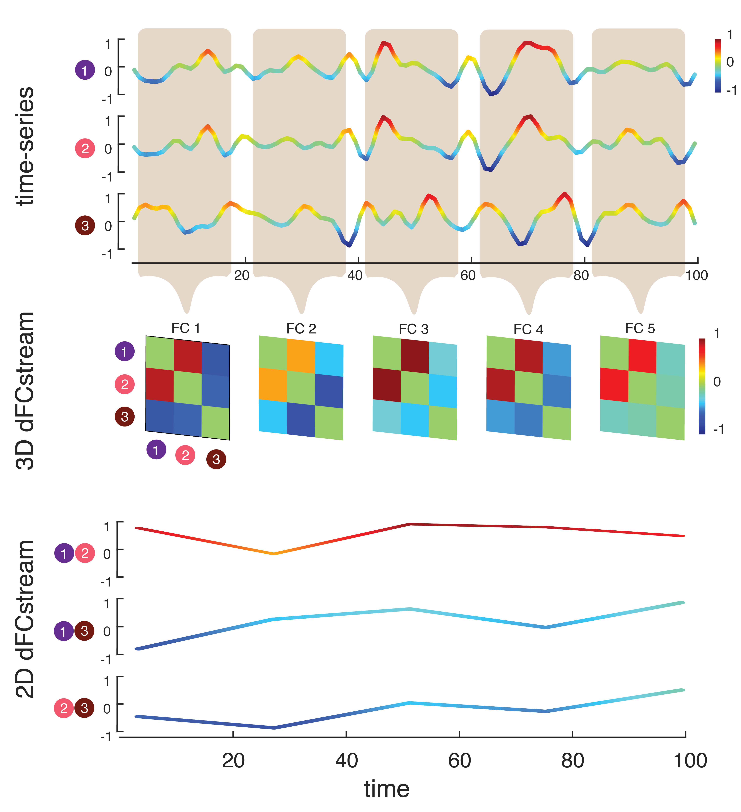
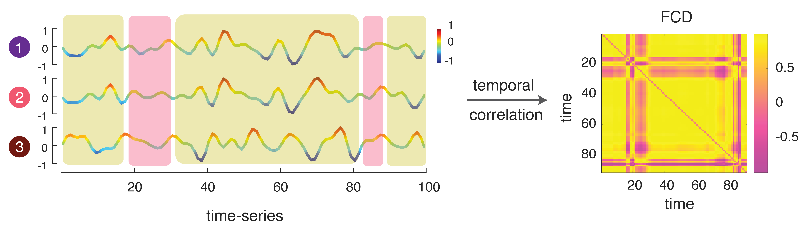
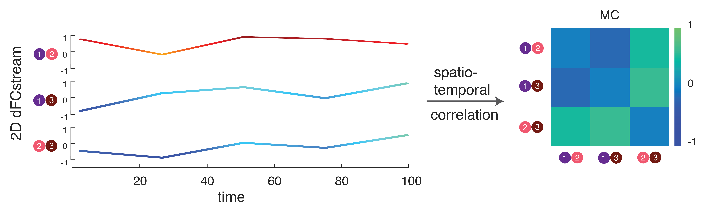
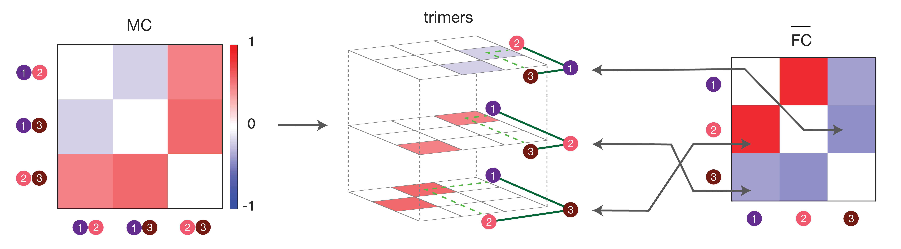

# INSdFCtoolbox

### TS2FC

The ```TS2FC``` function takes as input the time-series, then it computes the pearson correlation between pair of nodes and generates the time-averaged FC (functional connectivity) matrix as output with size nxn where n is the number of nodes. The FC gives information on the apatial aspect of time-series and quantifies the degree of similarity between pair of nodes. 


2. TS2dFCstream





3. dFCstream2dFC





4. dFCstream2MC





5. dFCstream2Trimers





